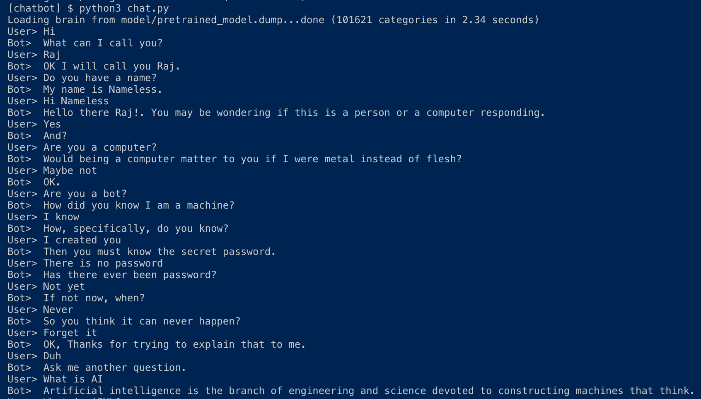
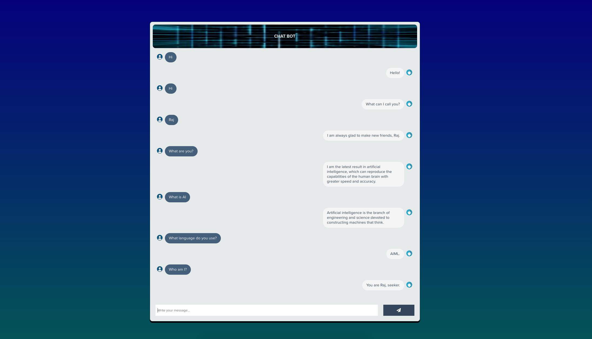

# Chatbot

## Environment
Python 3.7.x, pip3

## Requirements
* Flask
* **AIML** [Learn More](http://www.aiml.foundation/)
    ***Arificial Intelligence Markup Language*** is an XML dialect for creating natural language software agents.

```bash
pip3 install -r requirements.txt
```

^ *sudo* if required.

## Run

Run the app for CLI interaction
```bash
python3 chat.py
```

<div align="center">
    
</div>

OR

Run the app for web based interaction
```bash
python3 webchat.py
```

Goto **http://localhost:5000** in your browser.

<div align="center">
    
</div>

<hr>

## Appendix
* **chat.py**: code for loading and running the bot in CLI
* **webchat.py**: code for loading and running the bot on web
* **data/**: folder containing the AIML files
* model/**learning_files.aiml**: code for listing the files to train the bot
* model/**pretrained_model.dump**: a saved trained model that the bot can use
* templates/**home.html**: the html file for the web UI
* **requirements.txt**: file listing the Python dependencies

## References
[AIML tutorial](https://www.tutorialspoint.com/aiml/index.htm)
[Flask tutorial](https://www.tutorialspoint.com/flask/flask_application.htm)
[autocorrect](https://github.com/fsondej/autocorrect)
[Bootsnipp](https://bootsnipp.com/)

## PS
* More AIML files can be added/updated into the *data/* folder to improve the bot.
* A variety of HTML templates can be used from [Bootsnipp](https://bootsnipp.com/to) to improve the look of the web chat UI.